# Neobitcoin paper bot: architecture

Document status: implementation contract. External facts were checked on
2026-07-15. Deployment and acceptance evidence belongs in the timestamped final
report, not in this design document.

## Purpose and non-negotiable boundaries

The subsystem observes live market data for exactly one instrument and simulates
orders, fills, positions, exits, costs, and per-strategy equity. It is a separate
runtime from `neobitcoin-research`; it has its own Linux user, process, state,
writers, archive path, and delivery queue. It neither reads nor writes the
collector's runtime directories.

The pinned identity is:

- name: `Neo Bitcoin`;
- ticker: `BTCUSDperpA`;
- instrument UID: `4effa274-4e8f-422c-93ff-04aa34fe8e39`;
- class code: `SPBDMFUT`;
- type/exchange: futures on `spb_future`;
- lot: `1`;
- minimum price increment: `0.1`;
- market-data SDK: `t-tech-investments==1.49.2`.

Discovery is an exact identity check, not a partial-name match. A mismatch in
name, ticker, UID, class, or market-data availability disables strategies. A UID
change is a migration event, never an automatic substitution.

`PAPER_ONLY=true` is mandatory and immutable. There is no live mode flag, no live
execution adapter, and no permitted path from a strategy to a broker client.

## Component and trust-boundary map

```mermaid
flowchart LR
    API["T-Invest market data and instrument services"] -->|"read-only market observations"| ING["ReadOnlyMarketDataAdapter"]
    ING -->|"canonical event + quality state"| CAL["SessionCalendar"]
    ING -->|"canonical event"| FEAT["point-in-time feature builder"]
    CAL --> CTX["StrategyContext sandbox"]
    FEAT --> CTX
    CTX -->|"PaperIntent only"| STRAT["versioned strategy plugins"]
    STRAT -->|"immutable PaperIntent"| EXEC["PaperExecutionAdapter / engine"]
    ING -->|"first causal book or trade"| EXEC
    EXEC --> STATE["SQLite operational state"]
    EXEC --> DATA["typed daily datasets"]
    ING --> DATA
    DATA --> ARCH["archive worker + independent validation"]
    STATE --> ARCH
    ARCH --> OUTBOX["durable delivery outbox"]
    OUTBOX --> CODEX["same Codex task via official App Server"]
```



The apparent direction of the `STRAT` node is logical: a plugin is invoked by
the supervisor and returns a value. The plugin never owns transport, storage, or
execution objects.

## Safety model

Safety is enforced at several independent layers:

1. `PaperConfig.from_env` refuses startup unless `PAPER_ONLY` is exactly true;
   contradictory live-mode environment variables are rejected.
2. `safety.enforce_startup_boundary` scans loaded modules and runtime source for
   prohibited live-execution identifiers before the service starts.
3. Broker access is confined to a read-only facade whose intended calls are
   instrument discovery, market-data stream/status, and historical backfill.
4. `StrategyContext` contains only canonical events, point-in-time features,
   session context, data quality, and the version's own state. It contains no
   token, client, account service, filesystem handle, or future event.
5. A strategy can return only an immutable `PaperIntent`; only the central paper
   execution layer can materialize a virtual order.
6. The only execution implementation is `PaperExecutionAdapter`. It models
   aggressive/passive fills in memory and has no broker transport.
7. Static and runtime safety tests treat any prohibited live-order symbol in the
   runtime package as a release blocker. A token with unknown or broad scope does
   not widen code capability.
8. Secrets are systemd credentials, absent from arguments, environment examples,
   structured logs, configuration snapshots, manifests, and archives.

The primary service receives only the market-data credential. The archive worker
has `PrivateNetwork=true` and receives no broker credential. The delivery worker
receives only the Codex task identifier credential and not the broker credential.

## Market ingest and canonical timeline

The standalone service subscribes to order book depth 50, anonymous trades, last
price, one-minute and five-minute candles, instrument information/trading status,
subscription acknowledgements, and ping/heartbeat events. It does not consume the
local collector.

Every normalized event carries `exchange_ts`, `receive_ts`, `processing_ts`, a
deterministic event ID, revision/sequence, source, latency, data-quality state,
reconnect generation, and collector instance ID. The stable causal order is:

```text
exchange_ts, revision/sequence, receive_ts, event_id
```

All stored timestamps are UTC. Session interpretation uses the IANA zone
`Europe/Moscow`; it never inherits the VPS local timezone.

On disconnect the adapter records the discontinuity, applies exponential backoff
with jitter, rebuilds the stream and subscriptions, validates acknowledgements,
and requests available candle/last observations. It never invents a missing
order book. New entries remain disabled while disconnected, stale, gapped,
invalid, excessively latent, missing an acknowledgement, on unknown trading
status, or before the configured post-reconnect warmup completes.

## Session authority

`SessionCalendar` is effective-dated. The bundled rule starts on 2026-07-14 and
fails closed for earlier uncovered dates. Expected Neo crypto windows are
07:00–00:00 MSK on weekdays and 10:00–00:00 MSK on weekends/holidays. MOEX
regimes annotate the session, but do not authorize an entry.

The authority order is:

1. live T-Invest `Info`/trading-status subscription;
2. T-Bank's official Neo crypto window;
3. MOEX derivatives schedule and calendar for regime labels;
4. the reviewed effective-dated local rule as fallback metadata.

Only an explicitly open normalized live status makes `entry_allowed=true`.
Unknown is fail-closed even if the wall clock is inside a scheduled window. See
[`session_calendar.md`](session_calendar.md) for the complete rule and sources.

## Strategies and independent virtual accounts

The registry key is `strategy_id + version`. A version fixes status timestamps,
discovery source, description, parameters, code/config hashes, feature/execution/
risk model versions, session filters, warmup, entry cutoff, and carry policy.
Registration requires `activated_at` strictly after registration, preventing
retroactive OOS attribution. Any change to signal, parameters, execution, stop,
or exit logic creates a new version.

Each version owns a deterministic virtual account, cash/equity/PnL, open orders,
positions, drawdown, checkpoint, and decision history. Strategies cannot net or
close each other's positions. Plugin exceptions and timeouts are isolated by a
per-version supervisor with failure counters and a circuit breaker.

The initial frozen OOS set contains `STRONG_COUNTERFLOW_ABSORPTION_v1` and the
pre-registered `STRONG_COUNTERFLOW_ABSORPTION_v1-shadow-s6-t100` risk variant.
They run concurrently with independent virtual accounts and neither has priority
over later ideas. Their provenance and exact fixed rules are in
[`paper_strategy_spec.md`](paper_strategy_spec.md).

## Paper execution

A signal is not a fill. Each intent has an eligible timestamp after configured
decision latency. Aggressive entry consumes the first causally received eligible
book, buys asks for long entries and sells bids for short entries, traverses depth
to calculate VWAP, and records `FULL_FILL`, `PARTIAL_FILL`, or `NO_FILL` with the
source book ID. Insufficient or non-executable depth cannot become a full fill.

Passive entry retains queue ahead at the price, consumes only later aggressive
trade flow, permits partial fills, and expires/cancels on timeout, removed level,
or a continuity break. Removal of somebody else's displayed quantity is not a
fill.

Long exits execute against bids; short exits execute against asks after the
trigger and configured latency. Trigger and fill source events remain separate.
The model records spread, slippage, latency, holding/carry cost, gross/net PnL,
MFE, MAE, and their causal timestamps. Fixed stop, target, time, breakeven,
trailing, microstructure, order-book, and session-end policies are represented.
An exit cannot precede entry, and MFE/MAE are non-negative by definition.

An independent oracle does not import `PaperExecutionAdapter`; it recomputes
causal selection, VWAP, fills, PnL, position, MFE/MAE, and equity for validation.

## Persistence and crash recovery

Small restart-critical state is kept in SQLite under `state/`; market events are
never written there. The store uses schema migrations, foreign keys, WAL,
`synchronous=FULL`, a bounded busy timeout, transactional writes, stable
idempotency keys, online backup, WAL checkpointing, and `quick_check`.

One consistent recovery snapshot includes:

- restart generation and active session;
- immutable strategy versions and independent virtual accounts;
- strategy/worker checkpoints;
- open virtual orders and positions, including trailing/breakeven state;
- pending archives;
- the durable delivery outbox.

Session history is appended to crash-recoverable files ending in `.inprogress`.
Raw event windows use concatenated, independently complete ZSTD-JSONL frames;
smaller derived datasets use plain JSONL. Rejected candidates retain one causal
raw row, while accepted intents retain their full causal window. Finalization
closes writers and materializes exactly one typed, ZSTD-compressed Parquet file
per dataset, including a typed empty file for a zero-event dataset. A successful
materialization removes active markers. An archive is never built while any
`.inprogress` file remains.

The independent storage roots are:

```text
/opt/neobitcoin-paper/                 code symlink to an immutable release
/etc/neobitcoin-paper/                 root-controlled config and credentials
/var/lib/neobitcoin-paper/
  state/ active/ parquet/ event_windows/
  daily_archives/ delivery_outbox/ delivered/
  quarantine/ reports/ logs/
```

## Daily archive contract

After expected close, the runtime waits for a closed live status and the default
five-minute grace period. It closes writers, completes MFE/MAE through the last
honestly available observation, materializes the daily summary, validates the
bundle, computes per-file and archive SHA-256, and enqueues delivery. A restart
after midnight must resume this sequence idempotently. A zero-trade day still
produces an archive. Accelerated acceptance archives are explicitly type `TEST`
and are excluded from OOS statistics.

Each archive contains the required documents (`README.md`, `DAILY_SUMMARY.md`,
the JSON/Markdown manifests, schema dictionary, validation report, session
calendar, strategy registry, safe config snapshot, code version, and
`SHA256SUMS`) plus these 20 typed datasets:

1. `market_status_events.parquet`
2. `health_events.parquet`
3. `data_quality_events.parquet`
4. `strategy_evaluations.parquet`
5. `candidate_signals.parquet`
6. `filter_decisions.parquet`
7. `paper_orders.parquet`
8. `paper_fills.parquet`
9. `paper_positions.parquet`
10. `paper_trades.parquet`
11. `equity_curve.parquet`
12. `mfe_mae.parquet`
13. `shadow_stop_results.parquet`
14. `shadow_exit_results.parquet`
15. `raw_orderbook_event_windows.parquet`
16. `raw_trades_event_windows.parquet`
17. `raw_last_price_event_windows.parquet`
18. `raw_candles_event_windows.parquet`
19. `strategy_errors.parquet`
20. `delivery_events.parquet`

Validation reads every Parquet with PyArrow and DuckDB; checks exact schema,
primary/foreign keys, duplicates, timestamps, exit ordering, PnL/position/equity
reconciliation, source lineage, event-window coverage, and secrets; verifies
`SHA256SUMS`, archive SHA-256, and zstd/tar integrity. A failed build is reported
and quarantined and is never announced as successful.

## Delivery, supervision, and observability

The outbox idempotency key is
`session_date + archive_sha256 + thread_id`. Delivery verifies the artifact's
size and SHA before using the official Codex App Server handshake:
`initialize`, `initialized`, `thread/resume`, `turn/start`, then
`turn/completed`. A different resumed task ID or unexpected completed turn is an
error. Retry uses backoff/jitter and never blocks market ingest. See
[`codex_daily_delivery.md`](codex_daily_delivery.md).

Systemd owns three independent work paths:

- `neobitcoin-paper.service` — continuous ingest/strategy/execution/state;
- `neobitcoin-paper-archive.service` + `.timer` — isolated daily finalizer at
  about 00:15 MSK;
- `neobitcoin-paper-delivery.service` + `.timer` — non-blocking outbox retry,
  nominally once per minute.

Units run as `neopaper`, boot-enable the main service and timers, use automatic
restart for the continuous runtime, and apply filesystem/device/capability
hardening. Health is loopback-only at `127.0.0.1:8787` with `/healthz`,
`/readyz`, and `/metrics`. Structured JSON logs redact secret-like values.
Disk warning/critical/emergency thresholds stop new signals before integrity is
at risk; undelivered archives are never retention-deleted.

## Primary references

Checked 2026-07-15:

- [MOEX schedule change effective 2026-07-14](https://www.moex.com/n101980)
- [MOEX derivatives trading sessions](https://www.moex.com/torgovye-sessii-na-srochnom-rynke)
- [T-Bank: how Neo assets work and when crypto Neo assets trade](https://www.tbank.ru/invest/help/brokerage/account/forts/neo/)
- [T-Invest API: instrument availability and live trading status](https://russianinvestments.github.io/investAPI/head-instruments/)
- [T-Invest API: market-data subscriptions and status messages](https://russianinvestments.github.io/investAPI/marketdata/)
- [Official Codex App Server protocol](https://learn.chatgpt.com/docs/app-server.md)
